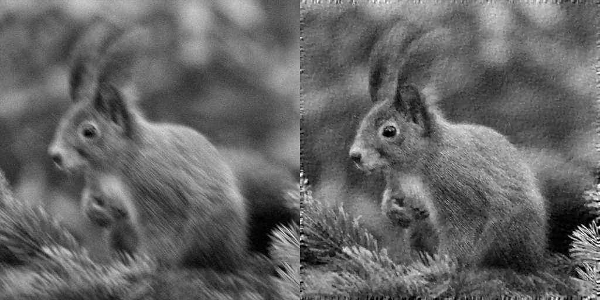

# differential-deconvolution-2D-cuda

## about

This project implements an algorithm, which given  the point-spread-function (PSF), restores the intrinsic image which was corrupted by the PSF and noise. The PSF is currently not spatially varying, i.e. this restoration is literally a deconvolution operator. The algorithm is inspired by [1], but instead of random walks optimization, it leverages computational capabilities of modern GPUs and processes all the pixels in parallel at each iteration. Also, instead of trying uninformed (minor) changes of pixel energy and checking, whether the objective function is improved or not, the derivative of objective function w.r.t. intrinsic image is computed directly and gradient descent optimization is used. Total variation regularizer for noise reduction is implemented as well. The host code is written in C++ and uses OpenCV library for convenient algorithm initialization. The subsequent iterative gradient descent optimization is offloaded to GPU as a sequence of CUDA kernels in the `for` loop. A demo application is provided in `main.cpp`.

## bibliography

[1] J. Gregson, F. Heide, M. B. Hullin, M. Rouf and W. Heidrich, "Stochastic Deconvolution," 2013 IEEE Conference on Computer Vision and Pattern Recognition, 2013, pp. 1043-1050, doi: 10.1109/CVPR.2013.139.
